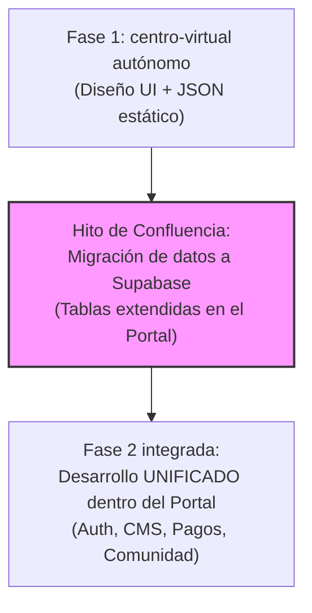

# Guía de Integración de Micrositios de Asociaciones
## Portal Galicia Migrante

Esta guía contiene la documentación del stack tecnológico del portal y todas las indicaciones, especificaciones técnicas y directrices de diseño necesarias para que un micrositio de asociación o una plantilla desarrollada de forma externa puedan integrarse de manera fluida y sencilla en el ecosistema de **Portal Galicia Migrante**.

---

## 1. Stack Tecnológico del Portal

Para asegurar la compatibilidad de cualquier componente o código a integrar, el portal utiliza las siguientes tecnologías principales:

*   **Framework:** [Next.js 16 (v16.2.9)](https://nextjs.org/) con la estructura **App Router**.
*   **Biblioteca de UI:** [React 19 (v19.2.4)](https://react.dev/).
*   **Base de Datos y Autenticación:** [Supabase](https://supabase.com/) (`@supabase/supabase-js` y `@supabase/ssr`).
*   **Estilos:** Hojas de estilo modulares (**Vanilla CSS Modules**, p. ej., `nombre.module.css`) para evitar colisiones de clases globales, y variables CSS globales para el tema visual.
*   **Internacionalización (i18n):** Soporte nativo para tres idiomas: **Gallego (GL)**, **Español (ES)** e **Inglés (EN)**.
*   **Traducción Automática:** API `/api/translate` interna que traduce automáticamente contenidos dinámicos no traducidos en tiempo de ejecución.

---

## 2. Modelos de Integración de Micrositios

Existen dos vías para incorporar un micrositio externo al portal:

### Vía A: Integración Dinámica basada en Datos (Recomendada)
Si el micrositio externo sigue la estructura estándar del portal (Información institucional, Comisión Directiva, y Noticias/Eventos), **no requiere programar código nuevo**. Basta con dar de alta la información en la base de datos de Supabase.

El portal renderiza automáticamente el micrositio en la ruta `/asociaciones/[slug]` basándose en los datos provistos.

### Vía B: Integración de Plantilla Frontend Personalizada
Si la asociación requiere un diseño o plantilla visual único y a medida:
1.  Se crea una subcarpeta dentro del router: `app/asociaciones/[slug]/templates/[nombre-plantilla]`.
2.  Se transforma el HTML/React externo en un componente de Next.js.
3.  Se encapsulan los estilos usando **CSS Modules** para evitar que alteren el resto de la aplicación.

---

## 3. Esquema de Base de Datos (Supabase)

La base de datos contiene tres tablas clave para gestionar la información de los micrositios. Toda plantilla o base de datos externa debe mapearse a esta estructura:

### Relaciones del Modelo
*   `asociaciones` tiene muchas `asociaciones_directivos`.
*   `asociaciones` tiene muchas `asociaciones_noticias`.

### Estructura de Tablas
1.  **`asociaciones`**: Contiene la información general de la institución (nombre, slug único para la URL, historia, dirección, logo, banner, etc.).
2.  **`asociaciones_directivos`**: Comisión Directiva y cargos.
3.  **`asociaciones_noticias`**: Noticias y publicaciones dinámicas.

### Script SQL de Creación del Modelo
Si necesitas configurar una base de datos de pruebas o producción para las asociaciones:

```sql
-- Tabla principal de asociaciones
CREATE TABLE asociaciones (
  id UUID PRIMARY KEY DEFAULT gen_random_uuid(),
  nombre VARCHAR(255) NOT NULL,
  slug VARCHAR(255) UNIQUE NOT NULL,
  fundacion INTEGER,
  descripcion_es TEXT,
  descripcion_gl TEXT,
  descripcion_en TEXT,
  historia_es TEXT,
  historia_gl TEXT,
  historia_en TEXT,
  finalidades_es TEXT,
  finalidades_gl TEXT,
  finalidades_en TEXT,
  email VARCHAR(255),
  telefono VARCHAR(100),
  direccion VARCHAR(255),
  ciudad VARCHAR(100),
  pais VARCHAR(100),
  logo_url TEXT,
  banner_url TEXT,
  activa BOOLEAN DEFAULT true,
  reclamada BOOLEAN DEFAULT false,
  admin_id UUID REFERENCES auth.users(id),
  created_at TIMESTAMP WITH TIME ZONE DEFAULT timezone('utc'::text, now())
);

-- Comisión Directiva / Staff
CREATE TABLE asociaciones_directivos (
  id SERIAL PRIMARY KEY,
  asociacion_id UUID REFERENCES asociaciones(id) ON DELETE CASCADE,
  nombre VARCHAR(255) NOT NULL,
  cargo_es VARCHAR(100),
  cargo_gl VARCHAR(100),
  cargo_en VARCHAR(100),
  orden INTEGER DEFAULT 0
);

-- Blog de Novedades y Noticias del Micrositio
CREATE TABLE asociaciones_noticias (
  id UUID PRIMARY KEY DEFAULT gen_random_uuid(),
  asociacion_id UUID REFERENCES asociaciones(id) ON DELETE CASCADE,
  titulo_es VARCHAR(255) NOT NULL,
  titulo_gl VARCHAR(255),
  titulo_en VARCHAR(255),
  contenido_es TEXT NOT NULL,
  contenido_gl TEXT,
  contenido_en TEXT,
  publicado BOOLEAN DEFAULT true,
  created_at TIMESTAMP WITH TIME ZONE DEFAULT timezone('utc'::text, now())
);
```

---

## 4. Guía Paso a Paso para Importar un Micrositio/Plantilla

Para añadir una plantilla visual diseñada en otro lado a la ruta `/asociaciones/[slug]`:

### Paso 1: Adecuación de Componentes
1.  **Conversión a React:** Si la plantilla está en HTML plano, divídela en componentes funcionales de React.
2.  **Rutas relativas e imágenes:** Mueve todos los recursos estáticos (imágenes, iconos) a la carpeta `public/images/asociaciones/[slug]/`. En el código de la plantilla, referéncialos usando rutas absolutas respecto a `public` (ej. `/images/asociaciones/...`).
3.  **Hooks e interactividad:** Si requiere interactividad del lado del cliente, asegúrate de colocar la directiva `'use client';` en la parte superior del archivo.

### Paso 2: Modularización de Estilos CSS
Para evitar colisiones de estilos entre la plantilla importada y el portal general:
1.  Renombra los archivos CSS de la plantilla a `[nombre].module.css`.
2.  En vez de usar clases globales (`<div className="card">`), importa los estilos como un objeto y aplícalos dinámicamente:
    ```javascript
    import styles from './mi-plantilla.module.css';

    export default function MiPlantilla() {
      return (
        <div className={styles.card}>
          {/* Contenido */}
        </div>
      );
    }
    ```

### Paso 3: Consumo de Datos e Internacionalización
Para mantener el soporte multiidioma nativo de la plataforma, utiliza las utilidades del portal:

```javascript
import { useTranslation } from '@/components/LanguageContext';

export default function MiPlantilla({ datosAsociacion }) {
  const { locale } = useTranslation();

  // Función para obtener el campo en el idioma seleccionado con fallback automático
  const obtenerTexto = (campoBase) => {
    // Si el locale es gallego, busca campoBase_gl; si es inglés, campoBase_en; si no, campoBase_es.
    const lang = locale.split('-')[0]; // 'es', 'gl', 'en'
    return datosAsociacion[`${campoBase}_${lang}`] || datosAsociacion[`${campoBase}_es`] || '';
  };

  return (
    <div>
      <h1>{datosAsociacion.nombre}</h1>
      <p>{obtenerTexto('descripcion')}</p>
    </div>
  );
}
```

---

## 5. Directrices de Identidad de Marca y UX

Cualquier plantilla o micrositio externo que se desee incorporar debe respetar los siguientes lineamientos visuales del manual de marca de Galicia Migrante:

1.  **Tipografías:**
    *   Títulos: `Outfit` o `Playfair Display` (elegancia, legado).
    *   Cuerpo de texto: `Inter` o `Roboto` (alta legibilidad).
2.  **Gama Cromática Sugerida:**
    *   *Azul Celta / Azul Galicia:* Para acentos primarios, enlaces y botones principales.
    *   *Tonos Neutros:* Fondos limpios en blanco o gris muy claro, con versiones oscuras compatibles para dark mode.
3.  **Responsividad:** Todos los layouts deben ser *Mobile-First*. El diseño debe adaptarse perfectamente a teléfonos móviles, tabletas y ordenadores de escritorio.
4.  **Carga de Imágenes:** Utilizar el componente `<Image />` de Next.js para optimizar automáticamente el tamaño, formato y lazy loading de las imágenes de banners y logos.

---

## 6. Contrapropuesta de Integración: Centro Lalín, Agolada y Silleda

*Redactado desde el proyecto del micrositio (`centro-virtual`) para su discusión con el equipo de Portal Galicia Migrante. No implica ningún cambio de código todavía — es un punto de partida para negociar el punto de encuentro entre ambos proyectos.*

### 6.1 Por qué ni la Vía A ni la Vía B puras alcanzan
El proyecto `centro-virtual` no es solo la página de una asociación dentro del portal: es la sede virtual de una institución de más de 120 años con un roadmap propio de dos fases (ver `PROJECT_SPEC.md`). Esto genera fricciones con ambos modelos de integración clásicos:

*   **Vía A (datos estándar) no alcanza:** El esquema de `asociaciones` / `asociaciones_directivos` / `asociaciones_noticias` no contempla secciones clave de la Fase 1 del sitio (`PROJECT_SPEC.md` §3.2, puntos 3 y 5):
    *   *Actividades y calendario de eventos* (con tipo, fecha, imagen).
    *   *Galería* (fotos históricas y de eventos).
    *   *Hitos históricos estructurados* (línea de tiempo). El campo `historia_es TEXT` aplana esto a un bloque de texto único en lugar de estructurarlo cronológicamente (`año` + `título` + `descripción` + `destacado`).
*   **Vía B (plantilla a medida) con JSON estático no es viable a largo plazo:** Aunque resuelve el problema de estructura de datos si se continúa usando archivos locales tipo `content/*.ts`, no aprovecha la infraestructura del portal (Supabase, panel de gestión de contenidos, hosting compartido). Esto va en contra del objetivo del proyecto: que la institución pueda administrar su propio contenido sin depender de un desarrollador para cada cambio menor.
*   **Superposición de Fase 2:** La Fase 2 de `centro-virtual` (`PROJECT_SPEC.md` §4) requiere cuentas de socio, comunidad interna, inscripción a eventos, cuotas societarias y streaming. Dado que un portal multi-asociación eventualmente necesitará resolver la autenticación y pagos de manera global, es vital acordar la gobernanza de esta capa ahora.

### 6.2 Propuesta: Plantilla Propia + Supabase como Fuente de Datos con Esquema Extendido
En vez de elegir una vía pura, proponemos un enfoque **híbrido**:

1.  **Diseño Visual Propio:** Se mantiene la identidad visual ya aprobada de `centro-virtual` (tipografías *Fraunces* + *Work Sans* + *IBM Plex Mono*, paleta Atlántica / Oro Toxo / Terracota) implementada como plantilla a medida (Vía B), ubicada en `app/asociaciones/[slug]/templates/centro-lalin/`.
2.  **Infraestructura Supabase:** La fuente de datos pasa a ser Supabase en lugar de estática, reutilizando las tablas ya definidas 1:1:
    *   `asociaciones` → Datos institucionales generales (nombre, dirección, logo, banner, contacto).
    *   `asociaciones_directivos` → Comisión Directiva.
    *   `asociaciones_noticias` → Sección Novedades.
3.  **Esquema Extendido (Tablas Propuestas):** Se proponen 3 tablas adicionales con soporte multiidioma para cubrir las necesidades específicas:

```sql
-- Actividades y eventos
CREATE TABLE asociaciones_actividades (
  id UUID PRIMARY KEY DEFAULT gen_random_uuid(),
  asociacion_id UUID REFERENCES asociaciones(id) ON DELETE CASCADE,
  titulo_es VARCHAR(255) NOT NULL,
  titulo_gl VARCHAR(255),
  titulo_en VARCHAR(255),
  descripcion_es TEXT,
  descripcion_gl TEXT,
  descripcion_en TEXT,
  tipo VARCHAR(50), -- danza | gaita | idioma | gastronomia | charla | otro
  kind VARCHAR(20),  -- actividad | evento
  fecha_inicio TIMESTAMP WITH TIME ZONE,
  fecha_fin TIMESTAMP WITH TIME ZONE,
  imagen_url TEXT,
  activo BOOLEAN DEFAULT true
);

-- Galería de fotos
CREATE TABLE asociaciones_galeria (
  id UUID PRIMARY KEY DEFAULT gen_random_uuid(),
  asociacion_id UUID REFERENCES asociaciones(id) ON DELETE CASCADE,
  imagen_url TEXT NOT NULL,
  epigrafe_es VARCHAR(255),
  epigrafe_gl VARCHAR(255),
  epigrafe_en VARCHAR(255),
  visibilidad VARCHAR(50) DEFAULT 'privado', -- privado | publico | colectivo_autorizado
  orden INTEGER DEFAULT 0
);


-- Hitos históricos estructurados (Línea de tiempo)
CREATE TABLE asociaciones_hitos_historicos (
  id UUID PRIMARY KEY DEFAULT gen_random_uuid(),
  asociacion_id UUID REFERENCES asociaciones(id) ON DELETE CASCADE,
  anio VARCHAR(20) NOT NULL, -- Permite rangos como "1976-1983"
  titulo_es VARCHAR(255) NOT NULL,
  titulo_gl VARCHAR(255),
  titulo_en VARCHAR(255),
  descripcion_es TEXT,
  descripcion_gl TEXT,
  descripcion_en TEXT,
  destacado BOOLEAN DEFAULT false,
  orden INTEGER DEFAULT 0
);
```

4.  **Estrategia de Internacionalización:** Dado que `centro-virtual` requiere inicialmente español, se propone cargar únicamente las columnas `_es`, dejando las columnas `_gl` y `_en` como `NULL`. El helper `obtenerTexto()` del portal resolverá esto transparentemente haciendo fallback al español.

### 6.3 Punto de Encuentro con la Fase 2
Antes de que comience la Fase 2 del micrositio, ambos equipos deben acordar:
*   **Autenticación de Socios:** Si el inicio de sesión y gestión de socios es un servicio centralizado del portal (compartido entre asociaciones) o si cada micrositio mantiene su propio esquema aislado.
*   **Pasarela de Pagos (Cuotas):** Si el modelo de pagos y cobro de cuotas societarias es genérico a nivel portal o si se integra a nivel particular de cada institución.
*   **CMS / Panel de Administración:** Si la edición del contenido extendido se realiza a través de la interfaz de administración del portal o mediante un desarrollo específico independiente.

### 6.4 Matriz Comparativa para Discusión

| Aspecto | Vía A (Portal Estándar) | Vía B (Plantilla Estática) | Propuesta Híbrida (Recomendada) |
| :--- | :--- | :--- | :--- |
| **Diseño visual propio** | Se pierde | Se mantiene | **Se mantiene** |
| **Actividades / Galería / Hitos** | Sin soporte | Soportado (código local) | **Soportado (tablas extendidas)** |
| **Gestión vía CMS sin código** | Sí (panel portal) | No (requiere dev) | **Sí (mediante panel portal extendido)** |
| **Esquema de BD requerido** | Ninguno | Ninguno | 3 tablas nuevas (`actividades`, `galeria`, `hitos`) |
| **Reutiliza Infraestructura** | Sí | No | **Sí** |

---

## 7. Punto de Confluencia y Estrategia de Desarrollo Compartido

Para lograr que el portal se enriquezca con el valor del `centro-virtual` sin generar duplicidad de código ni silos tecnológicos, definimos a continuación el **límite de desarrollo independiente** (punto de confluencia) y la **hoja de ruta de integración**.

### 7.1 Enriquecimiento Mutuo (El Portal gana)
El esfuerzo de adaptación del `centro-virtual` no beneficia únicamente a esta institución, sino que nutre directamente la funcionalidad global del **Portal Galicia Migrante**:
*   **Agenda Compartida de la Diáspora:** Las actividades ingresadas en `asociaciones_actividades` alimentarán automáticamente una **agenda unificada del portal**. Los usuarios podrán filtrar eventos gallegos por ciudad, país o modalidad (presencial/virtual) en un único mapa/calendario global.
*   **Fototeca Colectiva:** Las imágenes cargadas en `asociaciones_galeria` formarán parte de la fototeca histórica del portal (con atribución a la asociación de origen), enriqueciendo el archivo visual del ecosistema.
*   **Modularidad Heredable:** Al estandarizar el esquema de actividades, galerías e hitos cronológicos en el backend, cualquier nueva asociación que se sume al portal en el futuro podrá habilitar estas mismas secciones con un simple botón.

### 7.2 Límite del Desarrollo Independiente (Punto de Inflexión)
El desarrollo autónomo de `centro-virtual` debe tener un límite claro para evitar la divergencia tecnológica. 



*   **Hasta dónde avanza `centro-virtual` por fuera:**
    1.  Finaliza la maquetación y diseño visual de todas las pantallas de su **Fase 1** (Página principal, Historia, Comisión Directiva, Actividades y Galería).
    2.  Migra sus datos locales de prueba a la base de datos Supabase del portal utilizando las tablas extendidas detalladas en la sección 6.2.
*   **A partir de dónde se desarrolla todo DENTRO del portal:**
    Una vez que el micrositio de Centro Lalín se visualiza de forma dinámica consumiendo datos de Supabase, **se congela la rama de desarrollo independiente para los módulos centrales comunes**. Todo el roadmap prioritario de la **Fase 2 Común** se construye directamente en el repositorio del Portal Galicia Migrante:
    *   **Módulo de Autenticación de Socios (Incluido):** Se crea un sistema global de perfiles en el portal, donde el usuario puede registrarse una vez y "unirse" o "asociarse" a centros específicos.
    *   **Pasarela de Pagos / Suscripciones (Incluido):** Se desarrolla en el portal un motor multi-cuenta para gestionar el cobro de cuotas societarias de forma segura, transfiriendo los fondos correspondientes al procesador de pagos de cada asociación.
    *   **Panel de Administración (CMS) (Incluido):** Se extiende el `/admin` o `/dashboard` central del portal. Usando políticas de seguridad a nivel de fila (RLS) en Supabase, se habilita a los directivos de Centro Lalín a cargar sus propios hitos, noticias y actividades sin interferir con las de otras asociaciones.
    *   **Exclusiones Explícitas (Desarrollo Libre de `centro-virtual`):** Las características de *comunidad interna/foro, streaming de la propia institución, y gamificación cultural propia* no forman parte de este hito y son responsabilidad y decisión de desarrollo libre e independiente por parte de `centro-virtual` para su ámbito interno. El *Mapa de Centros Gallegos* (así como cualquier otra característica de relación interasociativa) queda excluido de esta autonomía y permanece bajo la tutela exclusiva del Portal (ver Sección 14).


---

## 8. Gobernanza de Medios Compartidos (orden explícita del propietario)

*`centro-virtual` y Portal Galicia Migrante son ambos proyectos del mismo propietario. Lo siguiente no es una propuesta a discutir entre partes — es una orden taxativa, aplicable a los dos proyectos por igual, sin lugar a interpretación.*

Respecto de la "Fototeca Colectiva" planteada en 7.1 (y, por extensión, cualquier documentación/medio compartido entre asociaciones):

1.  Las fotos y documentos **privados de una asociación** quedan de **uso exclusivo** de esa asociación. No se incorporan automáticamente a ningún archivo colectivo del portal.
2.  Solo pasan a **uso colectivo** aquellas fotos o documentos que sean **públicos**, o que involucren personas, temas o hechos que **trasciendan las fronteras de la asociación de origen** (ej. visitas de figuras públicas, hermanamientos, hechos históricos de alcance más amplio).
3.  Para que otra asociación o persona use material privado perteneciente a una asociación determinada, se requiere **sí o sí permiso explícito** de esa asociación. Sin excepción.

Esto implica, a nivel de esquema de datos, que `asociaciones_galeria` (y cualquier tabla de documentación análoga) necesita un campo que distinga el ámbito de cada ítem (privado / público / uso colectivo autorizado) — no puede asumirse que todo lo cargado por una asociación es reutilizable por otras por defecto.

## 9. Observaciones de `centro-virtual` sobre el punto de confluencia (sección 7)

Antes de aceptar el punto de confluencia tal como está planteado en la sección 7, quedan las siguientes observaciones sobre la mesa:

1.  **El "freeze" total de desarrollo independiente es más amplio de lo necesario.** La Fase 2 propia de `centro-virtual` (`PROJECT_SPEC.md` §4) tiene 8 puntos: cuentas de socio, comunidad interna/foro, agenda con inscripción, streaming, cuotas societarias, mapa de centros gallegos, contenido cultural interactivo/gamificación y notificaciones. La propuesta de la sección 7 solo cubre genéricamente 3 de esos (auth, pagos, CMS). Si se congela *todo* el desarrollo local en el hito de confluencia, el resto (foro, streaming, gamificación, mapa) queda sujeto a la priorización del roadmap del portal — que responde a las necesidades de *todas* las asociaciones, no solo a las de esta institución — con riesgo real de estancamiento.
2.  **Migrar los datos a Supabase y "mudar" el desarrollo de Fase 2 al portal son dos decisiones distintas, y la sección 7 las ata al mismo hito.** Se puede migrar `content/*.ts` → Supabase (y ganar el CMS antes) sin comprometerse todavía a que auth/pagos/comunidad se construyan dentro del portal. Separar ambas decisiones da más margen de maniobra.
3.  **Riesgo de dependencia de cronograma.** Si el desarrollo de auth global o de la pasarela de pagos multi-cuenta del portal se atrasa, la Fase 2 de Centro Lalín queda bloqueada por completo, dado que "el desarrollo independiente se congela". Se propone, como alternativa, un modelo con **válvula de escape**: apuntar a usar los servicios del portal como fuente de verdad una vez que estén listos y cubran lo necesario, pero permitir que `centro-virtual` construya piezas propias (detrás de un flag, reemplazables después) si el portal no llega a tiempo con lo que esta Fase 2 necesita.
4.  **Fototeca/medioteca colectiva**: resuelto — ver punto 8.

**Propuesta concreta**: dividir el punto de confluencia en dos hitos independientes en vez de uno solo:
- **(a) Migración de datos a Supabase + CMS** — beneficia a ambos proyectos ya, bajo riesgo, sin condicionar nada más.
- **(b) Adopción de auth/pagos/comunidad del portal** — condicionada a que esos módulos existan y cubran lo que la Fase 2 de Centro Lalín necesita, no antes ni por defecto.

---

## 10. Mejoras Incorporadas al Esquema e Integración

Para responder a las observaciones del propietario y asegurar la robustez arquitectónica, se incorporan las siguientes especificaciones:

### 10.1 Abstracción de Datos en Frontend (Patrón Adaptador)
*   La plantilla de `centro-virtual` consumirá los datos obligatoriamente a través de un adaptador de datos (Hook/Servicio, ej. `useMicrositioData()`).
*   Esto aislará los componentes visuales del origen de datos, facilitando el cambio de JSON locales (mock) a Supabase en el Hito (a), y la futura migración de Auth en el Hito (b).

### 10.2 Control de Auditoría para Medios Compartidos
*   La tabla `asociaciones_galeria` incluye las columnas:
    *   `visibilidad` (`VARCHAR(50) DEFAULT 'privado'`) para respetar la gobernanza del propietario.
    *   `anio_captura` (`INTEGER`) para ordenar cronológicamente la fototeca histórica de forma correcta.
    *   `autor` (`VARCHAR(255)`) para el respeto a la autoría/créditos.
    *   `autorizado_por` (`UUID REFERENCES auth.users`) e `fecha_autorizacion` (`TIMESTAMP`) para la auditoría de consentimiento de medios compartidos.

---

## 11. División de Tareas por Proyecto

Para la ejecución de la confluencia, se dividen las responsabilidades técnicas de la siguiente manera:

### 11.1 Tareas en el repositorio del Portal Galicia Migrante (Nos corresponde a nosotros)

#### Hito (a): Migración y visualización dinámica
1.  **Ejecutar Migración de Base de Datos:** Crear la migración SQL en `/database/migrations` con las tablas extendidas (`asociaciones_actividades`, `asociaciones_galeria`, `asociaciones_hitos_historicos`) incluyendo los campos de auditoría, visibilidad y metadatos históricos.
2.  **Configurar RLS en Supabase:** Definir políticas de lectura pública y escritura restringida por `admin_id`.
3.  **Habilitar Carga Temporal:** Proveer políticas RLS para carga inicial o un panel simplificado no-code para que el administrador de Centro Lalín empiece a cargar sus datos desde el día 1.
4.  **Enrutamiento Dinámico:** Configurar la ruta `/asociaciones/[slug]` para cargar condicionalmente la plantilla específica de `centro-lalin` cuando corresponda.
5.  **Efectos Globales (Consolidación):**
    *   Integrar los eventos de `asociaciones_actividades` en la agenda/calendario global del portal.
    *   Consolidar imágenes públicas de `asociaciones_galeria` en la fototeca compartida del portal.

#### Hito (b): Integración de Servicios Complejos (Fase 2)
1.  **Desarrollo del Core Multi-tenant:** Diseñar el sistema de perfiles/socios y la pasarela de pagos multi-cuenta del portal.
2.  **Panel de Administración CMS:** Diseñar el panel `/admin` definitivo con roles específicos por asociación.

---

### 11.2 Tareas en el repositorio de centro-virtual (Equipo Externo)

#### Hito (a): Migración y visualización dinámica
1.  **Finalizar Fase 1 Frontend:** Completar el diseño visual con sus tipografías y paletas de colores exclusivas.
2.  **Modularización de Estilos:** Asegurar el uso de CSS Modules (`.module.css`) para aislar completamente sus estilos del resto del portal.
3.  **Desarrollo del Adaptador de Datos:** Construir la plantilla para que dependa exclusivamente del hook `useMicrositioData()`.
4.  **Entrega e Importación:** Empaquetar y exportar la carpeta de la plantilla para ser copiada bajo `app/asociaciones/[slug]/templates/centro-lalin/` en el portal.

#### Hito (b): Integración de Servicios Complejos (Fase 2)
1.  **Uso de APIs del Portal (Alcance Acotado):** Integrar exclusivamente los flujos de autenticación de socios, pasarela de pagos/cuotas societarias, y la inscripción a eventos de la agenda consumiendo los servicios unificados del portal.
2.  **Desarrollo Independiente de Exclusiones (Ámbito Interno):** El equipo de `centro-virtual` mantiene plena autonomía para programar de forma interna sus módulos de *comunidad interna/foro, streaming institucional propio, y gamificación cultural de su incumbencia*. El *Mapa de Centros Gallegos* (y cualquier red intersocietaria) queda estrictamente bajo control y desarrollo del portal.
3.  **Válvula de Escape:** En caso de demoras en la plataforma global para los servicios del Hito (b) acotado, implementar soluciones locales temporales encapsuladas detrás de feature flags para no bloquear su salida a producción.

### 11.3 Confirmación funcional de identidad del solicitante de asociación (implementado en `centro-virtual`, 2026-07-03)

Nota para cuando se ejecute la migración del Hito (a): la solicitud de asociación de `centro-virtual` (tabla propia `solicitudes_socio`, todavía no migrada a `asociaciones_*`) incorpora una confirmación de identidad **funcional, no legal ni biométrica**, pensada como sustituto de la firma manuscrita de la solicitud impresa mientras no exista panel/CMS del portal para procesarla en papel:

- Se descartó comparar biométricamente la foto del wizard contra la foto del DNI: el documento suele tener años/décadas de antigüedad y el envejecimiento del rostro genera falsos negativos no relacionados con fraude. También se descartó RENAPER (requiere convenio oficial no disponible).
- En su lugar, el solicitante confirma por mail (link con token, automático) y/o por WhatsApp (mensaje prellenado a la institución, marcado manual). Cualquiera de los dos alcanza.
- Mientras no haya confirmación, la solicitud queda con `confirmed_at = null` — la leyenda "sujeta a verificación de identidad" debe reflejarse en el futuro panel/CMS del portal (11.1, Hito a, punto 3) cuando la comisión directiva la revise, no solo en la base de datos.
- Queda pendiente y bloqueada la confirmación alternativa por parte del socio que presenta/avala al solicitante (el "referente"): requiere un padrón de socios con contacto real, que es responsabilidad del Hito (b) (autenticación de socios, punto 11.1). Cuando ese padrón exista, sería deseable que el portal permita que el referente confirme "conozco y avalo a esta persona" como alternativa suficiente a la confirmación por mail/WhatsApp.
- Detalle técnico completo en `doc/PROJECT_SPEC.md` §8.2c.

---

## 12. Observaciones de `centro-virtual` sobre la sección 10-11 (ronda de seguimiento)

*Registrado por `centro-virtual` en respuesta a las secciones 10 y 11. Las tres objeciones planteadas en el punto 9 quedan resueltas:*

- **Objeción 9.4 (fototeca)** → resuelta por 10.2 (`visibilidad` default `'privado'`, `autorizado_por` + `fecha_autorizacion` para auditoría de consentimiento). Coincide con la orden del punto 8.
- **Objeción 9.2 (acoplar migración de datos con adopción de auth/pagos)** → resuelta por 10.1 (patrón adaptador `useMicrositioData()`): el origen de datos queda aislado de los componentes visuales, por lo que pasar de JSON local a Supabase no obliga a decidir nada sobre auth/pagos/comunidad todavía.
- **Objeción 9.3 (riesgo de dependencia de cronograma)** → resuelta por 11.2.2 (válvula de escape explícita: feature flags con soluciones locales temporales si el portal se atrasa).

### 12.1 Punto pendiente de precisión: alcance real del Hito (b)

El punto 11.2.1 dice *"Integrar los flujos de autenticación **e inscripciones** consumiendo los componentes y servicios unificados del portal"*, sin acotar qué se entiende por "inscripciones". La objeción 9.1 seguía vigente: la Fase 2 propia de `centro-virtual` (`PROJECT_SPEC.md` §4) tiene 8 puntos, y el Hito (b) tal como está redactado en la sección 7 solo cubre genéricamente 3 (auth, pagos, CMS). Los otros 4 — **comunidad interna/foro, streaming, mapa de centros gallegos, contenido cultural interactivo/gamificación** — no tienen módulo equivalente propuesto en el portal.

**Sugerencia concreta**: dejar taxativamente aclarado que el Hito (b) cubre únicamente auth de socios, pagos de cuotas, agenda con inscripción a eventos (de ahí "inscripciones") y CMS — y que foro, streaming, mapa de centros gallegos y gamificación cultural **siguen siendo responsabilidad y decisión exclusiva de `centro-virtual`**, a desarrollarse cuando su propio roadmap lo indique, sin depender de que el portal los priorice ni de que exista módulo genérico equivalente. Si en el futuro el portal decide construir algo reutilizable para esas 4 áreas, se evalúa entonces como una adopción adicional — no como parte del Hito (b) original.

### 12.2 Nota de proceso

Este documento funciona como bitácora de ida y vuelta entre ambos proyectos (secciones 6→7→8/9→10/11→12→...) y se espera seguir iterando así las veces que sea necesario a medida que surjan nuevas rondas de observaciones de cualquiera de los dos lados.

---

## 13. Resolución de la Ronda de Seguimiento (Sección 12)

*Registrado por el equipo del Portal Galicia Migrante en respuesta a la precisión 12.1:*

1.  **Aceptación e Incorporación:** Se acepta plenamente la precisión del alcance de la Fase 2. La redacción de la **Sección 7.2** (Límite del Desarrollo) y la **Sección 11.2** (Tareas de centro-virtual) ha sido actualizada para listar explícitamente qué queda dentro y qué queda fuera del Hito (b).
2.  **Estado del Acuerdo:** El alcance del Hito (b) queda limitado a: **Autenticación de socios**, **Pasarela de pagos/cuotas**, **CMS unificado** e **Inscripciones a la agenda**.
3.  **Autonomía de Módulos Específicos:** Los componentes de *foro, streaming local y gamificación interna* son 100% autónomos del equipo de `centro-virtual`, integrables a futuro. El *Mapa de Centros Gallegos* y cualquier red intersocietaria se excluyen de esta lista.

---

## 14. Principio de Soberanía del Portal e Intersociabilidad (Orden Taxativa)

*Establecido por el propietario de Portal Galicia Migrante y de centro-virtual como directriz de gobernanza y arquitectura definitiva:*

1.  **Monopolio de Relaciones Intersocietarias:** Cualquier tipo de relación, red, comunicación, mapeo o interacción que involucre a **más de un centro o asociación** (ej. federaciones de centros, mapas colectivos de centros gallegos, mensajería inter-centros, eventos conjuntos coordinados) es de competencia exclusiva del **Portal Galicia Migrante**. Ningún centro o micrositio particular tiene autorización para desarrollar de forma independiente sistemas que conecten o agrupen a otros centros.
2.  **Límite de Incumbencia de los Centros:** Cada asociación (incluido el Centro Lalín) es soberana únicamente de sus **asuntos internos**: su comisión directiva, sus noticias, su historia institucional, su agenda de eventos propios, su streaming local y sus socios.
3.  **El Portal como Autoridad Tutelar:** El portal actúa como el núcleo central del ecosistema ("tiene el ancho de espadas"). Las funciones de intersociabilidad serán provistas como un servicio central por el portal para el libre uso de los centros, pero siempre bajo la tutela, control de datos y regulaciones del propio portal.

---

## 15. Resolución de la Sección 11.2, punto 2 (CSS) y Política de Catálogo de Plantillas

*Registrado por el equipo del Portal Galicia Migrante, en respuesta a la consulta de `centro-virtual` sobre el conflicto entre el punto 2 de la Sección 11.2 (pedido de CSS Modules) y el stack real del proyecto (Tailwind CSS, sin ningún `.module.css`):*

### 15.1 Sobre CSS y Tailwind
No es necesario migrar a CSS Modules. El portal acepta que `centro-virtual` utilice Tailwind CSS para el micrositio.

**Condición de aislamiento:** para evitar colisiones con el diseño base del portal, `centro-virtual` debe, al momento de empaquetar la plantilla para el portal:
- Desactivar el *reset* global de Tailwind (`preflight: false` en `tailwind.config.ts`), y/o
- Encapsular los estilos base bajo una clase contenedora única del micrositio (ej. `.lalin-theme`).

Esto reemplaza el punto 2 de la Sección 11.2 ("Modularización de Estilos con CSS Modules").

### 15.2 Base de datos (Supabase) para desarrollo
Confirma lo ya acordado: durante la Fase 1, `centro-virtual` usa un proyecto Supabase propio (sandbox/gratuito), con el mismo esquema SQL extendido de la Sección 6.2/10.2. Al momento de la entrega, el portal exporta esos datos (volcado SQL/CSV) y los importa al Supabase principal — al ser esquemas idénticos, la integración es directa.

### 15.3 Política de Catálogo de Plantillas (nuevo)
El portal no admitirá plantillas personalizadas ilimitadas: funcionará con un **catálogo cerrado de 2 o 3 plantillas**. El diseño de `centro-virtual` se integrará y estandarizará como una de estas opciones oficiales del catálogo — el portal la hospeda y otras asociaciones podrán elegirla a futuro.

### 15.4 Estado de espera
El portal queda a la espera de que `centro-virtual` alcance el Hito (a) completo: maquetación visual finalizada + adaptador de datos (`useMicrositioData()`) conectado al Supabase de pruebas propio, para iniciar la importación del micrositio al portal.

